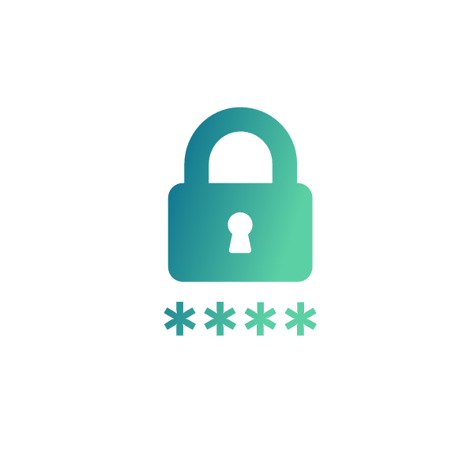
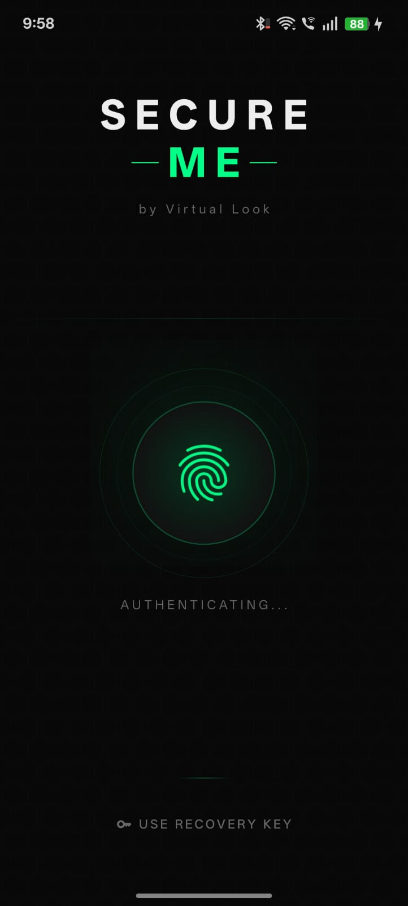
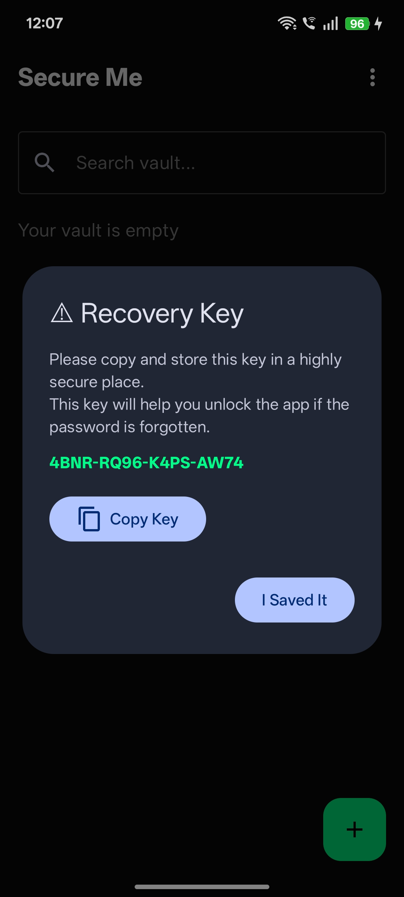
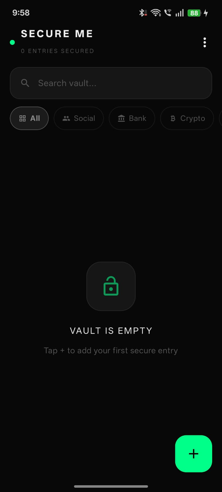
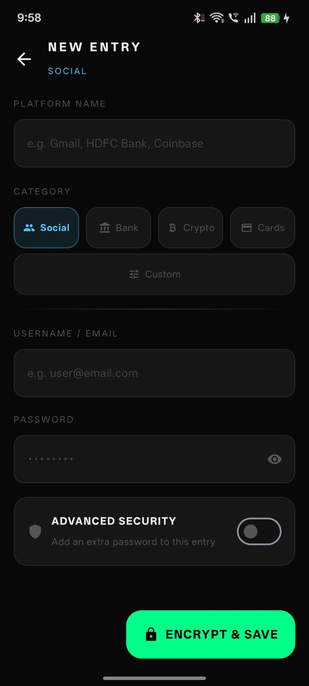

  

<h1 align="center">Secure Me</h1>

A privacy-focused encrypted vault for storing passwords, bank details, crypto wallets, and sensitive credentials securely on Android.

  

---

# 📥 Download

Download the latest APK from GitHub Releases.

🔗 https://github.com/CodingWorld-007/Secure-Me-Application/releases/latest

---

## The Problem

I had nearly **10 Gmail accounts** for different purposes such as testing, projects, and registrations.

Over time I realized that I had forgotten passwords for several of them.

Every time I needed access, I had to go through the entire **Forgot Password process** again and again.

Verification emails. Recovery codes. Security questions.

It became frustrating.

Storing passwords in a notes app didn't feel safe either.

Notes apps are not designed to store sensitive data like passwords, bank details, or crypto keys.

So I built **SecureMe** — a secure encrypted vault to store sensitive information safely.

All data is stored **locally on the device and encrypted**.

---

## Features

• AES encrypted vault storage  
• Biometric authentication (fingerprint / device security)  
• Secure recovery key system  
• Screenshot protection  
• Storage for passwords, bank details, crypto wallets and cards  
• Custom secure fields  
• Offline-first design (no cloud storage)

Your data **never leaves your device**.

---

## Tech Stack

Kotlin  
Jetpack Compose  
Room Database  
SQLCipher encrypted database  
AES encryption  
Android Biometric API  
MVVM architecture

---

## Screenshots

| Lock Screen | Recovery Key |
|-------------|-----------|
|  |  |

| Dashboard | Add Entry |
|-----------|---------------|
|  |  |

---

## Security Architecture

SecureMe follows a layered security model.

1. AES encryption protects vault data.
2. SQLCipher encrypted database stores encrypted payloads.
3. Biometric authentication prevents unauthorized access.
4. Recovery key system enables account recovery.
5. Screenshot protection prevents screen capture of sensitive data.

All encryption operations happen **locally on the device**.

---

## Architecture

---

## Why This Project

SecureMe started as a personal problem but evolved into a project focused on security and privacy.

Through building this project I explored:

• Secure data storage on Android  
• Encryption and cryptography concepts  
• Biometric authentication  
• Designing security-focused user experiences

---

## Author

Aman Joshi

LinkedIn  
https://www.linkedin.com/in/amanajjoshi

---

## License

This project is licensed under the MIT License.
